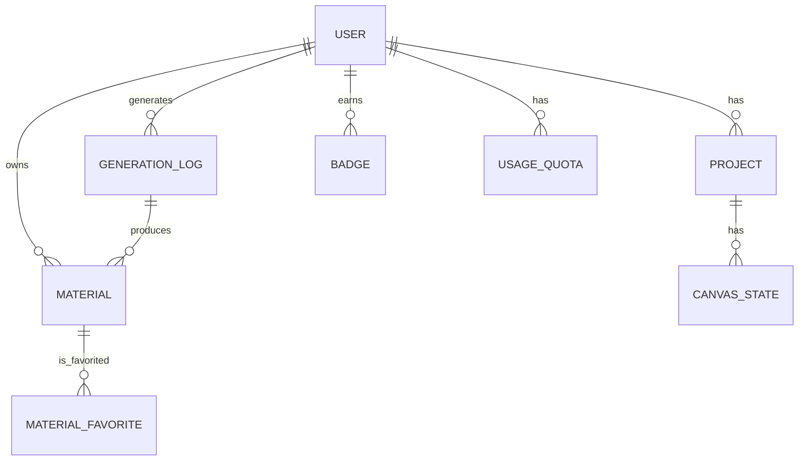
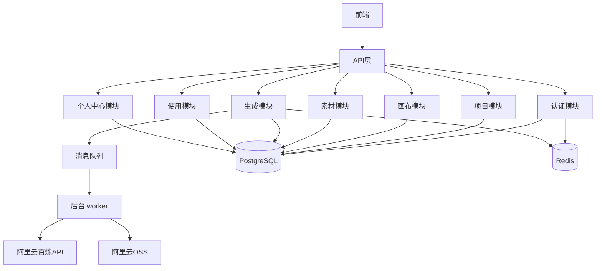

# 千域空间 PC平台 后端技术实现方案

## 一、深度理解需求（对齐业务）

### 1. 标注功能边界

| 功能模块 | 与后端直接相关的核心功能逻辑 | 涉及数据变更的节点 | 第三方依赖 | 非功能性需求 |
|---------|-------------------------|----------------|----------|------------|
| 账号系统 | 邮箱登录/注册、验证码发送、密码管理、额度管理、消费明细查询 | 用户注册、密码修改、额度扣减、消费记录创建 | 邮箱服务（验证码发送） | 60秒内完成注册到首次使用 |
| 无限画布 | 项目创建、画布状态保存、元素操作 | 项目创建/更新/删除、画布状态更新 | 阿里云OSS（存储图片/视频） | 画布自动保存≤3秒 |
| AI对话助手 | 自然语言处理、参数调整、生成任务管理、结果处理 | 生成任务创建/更新、消费记录创建 | 阿里云百炼API | 图片生成时间≤30秒，视频生成时间≤120秒 |
| 图片生成 | 文生图、图生图、局部重绘 | 素材创建、消费记录创建 | 阿里云百炼API | 图片生成时间≤30秒 |
| 视频生成 | 文生视频、图生视频 | 素材创建、消费记录创建 | 阿里云百炼API | 视频生成时间≤120秒 |
| 素材管理 | 个人素材库管理、收藏夹管理 | 素材创建/删除、收藏关系创建/删除 | 阿里云OSS | - |
| 个人中心 | 作品列表查询、徽章展示、使用统计 | 徽章发放 | - | - |

### 2. 识别隐含逻辑

#### 状态机流转
- **生成任务状态**：待处理 → 处理中 → 成功/失败
- **项目状态**：创建 → 活跃 → 归档

#### 数据校验规则
- **邮箱**：格式验证，唯一性检查
- **密码**：长度≥8位，包含字母和数字
- **项目名称**：非空，最大长度50字符
- **生成参数**：尺寸、数量、风格等参数范围校验

#### 定时任务/延时任务
- 生成任务超时处理
- 未完成任务清理

### 3. 产出疑问清单

| 疑问点 | 描述 | 建议确认 |
|-------|------|--------|
| 邮箱验证码有效期 | PRD未明确验证码有效期 | 建议设置为5分钟 |
| 生成任务取消机制 | 生成过程中如何处理取消操作 | 建议实现异步任务取消机制 |
| 素材存储策略 | 素材是否有过期清理机制 | 建议设置自动清理策略 |
| 消费统计周期 | 消费统计的时间周期定义 | 建议按日、周、月统计 |
| 徽章获取条件 | 具体的徽章获取规则 | 建议与产品确认详细规则 |

## 二、技术方案设计（核心产出）

### 1. 数据库设计

#### ER图

#### 表结构文档

**`user`表**
| 字段名 | 数据类型 | 约束 | 描述 |
|-------|---------|------|------|
| `id` | `SERIAL` | `PRIMARY KEY` | 用户ID |
| `email` | `VARCHAR(255)` | `UNIQUE NOT NULL` | 邮箱地址 |
| `password_hash` | `VARCHAR(255)` | `NOT NULL` | 密码哈希 |
| `nickname` | `VARCHAR(50)` | `NOT NULL` | 用户昵称 |
| `avatar` | `VARCHAR(255)` | | 头像URL |
| `created_at` | `TIMESTAMP` | `DEFAULT CURRENT_TIMESTAMP` | 创建时间 |
| `updated_at` | `TIMESTAMP` | `DEFAULT CURRENT_TIMESTAMP` | 更新时间 |

**`project`表**
| 字段名 | 数据类型 | 约束 | 描述 |
|-------|---------|------|------|
| `id` | `SERIAL` | `PRIMARY KEY` | 项目ID |
| `user_id` | `INTEGER` | `REFERENCES user(id)` | 用户ID |
| `name` | `VARCHAR(50)` | `NOT NULL` | 项目名称 |
| `cover_image` | `VARCHAR(255)` | | 封面图片URL |
| `created_at` | `TIMESTAMP` | `DEFAULT CURRENT_TIMESTAMP` | 创建时间 |
| `updated_at` | `TIMESTAMP` | `DEFAULT CURRENT_TIMESTAMP` | 更新时间 |

**`canvas_state`表**
| 字段名 | 数据类型 | 约束 | 描述 |
|-------|---------|------|------|
| `id` | `SERIAL` | `PRIMARY KEY` | 状态ID |
| `project_id` | `INTEGER` | `REFERENCES project(id)` | 项目ID |
| `state_data` | `JSONB` | `NOT NULL` | 画布状态数据 |
| `created_at` | `TIMESTAMP` | `DEFAULT CURRENT_TIMESTAMP` | 创建时间 |
| `updated_at` | `TIMESTAMP` | `DEFAULT CURRENT_TIMESTAMP` | 更新时间 |

**`material`表**
| 字段名 | 数据类型 | 约束 | 描述 |
|-------|---------|------|------|
| `id` | `SERIAL` | `PRIMARY KEY` | 素材ID |
| `user_id` | `INTEGER` | `REFERENCES user(id)` | 用户ID |
| `type` | `VARCHAR(20)` | `NOT NULL` | 素材类型（image/video） |
| `url` | `VARCHAR(255)` | `NOT NULL` | 素材URL |
| `name` | `VARCHAR(100)` | `NOT NULL` | 素材名称 |
| `width` | `INTEGER` | | 宽度 |
| `height` | `INTEGER` | | 高度 |
| `duration` | `INTEGER` | | 视频时长（秒） |
| `created_at` | `TIMESTAMP` | `DEFAULT CURRENT_TIMESTAMP` | 创建时间 |

**`usage_quota`表**
| 字段名 | 数据类型 | 约束 | 描述 |
|-------|---------|------|------|
| `id` | `SERIAL` | `PRIMARY KEY` | 额度ID |
| `user_id` | `INTEGER` | `REFERENCES user(id)` | 用户ID |
| `daily_quota` | `INTEGER` | `DEFAULT 0` | 每日额度 |
| `used_today` | `INTEGER` | `DEFAULT 0` | 今日已用 |
| `last_reset` | `DATE` | `DEFAULT CURRENT_DATE` | 上次重置日期 |

**`generation_log`表**
| 字段名 | 数据类型 | 约束 | 描述 |
|-------|---------|------|------|
| `id` | `SERIAL` | `PRIMARY KEY` | 日志ID |
| `user_id` | `INTEGER` | `REFERENCES user(id)` | 用户ID |
| `type` | `VARCHAR(20)` | `NOT NULL` | 生成类型（image/video） |
| `prompt` | `TEXT` | `NOT NULL` | 生成提示词 |
| `params` | `JSONB` | | 生成参数 |
| `duration_seconds` | `INTEGER` | | 视频时长（秒） |
| `image_count` | `INTEGER` | | 图片数量 |
| `unit_cost` | `DECIMAL(10,2)` | `NOT NULL` | 单价 |
| `total_cost` | `DECIMAL(10,2)` | `NOT NULL` | 平台成本 |
| `charge_amount` | `DECIMAL(10,2)` | `NOT NULL` | 用户收费 |
| `profit` | `DECIMAL(10,2)` | `NOT NULL` | 平台利润 |
| `status` | `VARCHAR(20)` | `NOT NULL` | 状态（pending/processing/success/failed） |
| `created_at` | `TIMESTAMP` | `DEFAULT CURRENT_TIMESTAMP` | 创建时间 |
| `completed_at` | `TIMESTAMP` | | 完成时间 |

**`badge`表**
| 字段名 | 数据类型 | 约束 | 描述 |
|-------|---------|------|------|
| `id` | `SERIAL` | `PRIMARY KEY` | 徽章ID |
| `name` | `VARCHAR(50)` | `NOT NULL` | 徽章名称 |
| `description` | `TEXT` | | 徽章描述 |
| `icon` | `VARCHAR(255)` | | 徽章图标URL |

**`user_badge`表**
| 字段名 | 数据类型 | 约束 | 描述 |
|-------|---------|------|------|
| `id` | `SERIAL` | `PRIMARY KEY` | 记录ID |
| `user_id` | `INTEGER` | `REFERENCES user(id)` | 用户ID |
| `badge_id` | `INTEGER` | `REFERENCES badge(id)` | 徽章ID |
| `earned_at` | `TIMESTAMP` | `DEFAULT CURRENT_TIMESTAMP` | 获得时间 |

**`material_favorite`表**
| 字段名 | 数据类型 | 约束 | 描述 |
|-------|---------|------|------|
| `id` | `SERIAL` | `PRIMARY KEY` | 收藏ID |
| `user_id` | `INTEGER` | `REFERENCES user(id)` | 用户ID |
| `material_id` | `INTEGER` | `REFERENCES material(id)` | 素材ID |
| `created_at` | `TIMESTAMP` | `DEFAULT CURRENT_TIMESTAMP` | 收藏时间 |

#### 索引设计

| 表名 | 索引字段 | 索引类型 | 说明 |
|-----|---------|---------|------|
| `user` | `email` | `UNIQUE` | 加速邮箱登录查询 |
| `project` | `user_id, created_at` | `INDEX` | 加速用户项目列表查询 |
| `canvas_state` | `project_id` | `INDEX` | 加速项目画布状态查询 |
| `material` | `user_id, created_at` | `INDEX` | 加速用户素材库查询 |
| `generation_log` | `user_id, created_at` | `INDEX` | 加速用户消费记录查询 |
| `generation_log` | `status` | `INDEX` | 加速任务状态查询 |

#### 数据迁移预案
- 初始数据导入：徽章数据预设
- 后续迭代：新增字段设置合理默认值

#### 分库分表评估
- 预估数据量级：初期用户量10万，每日生成任务100万
- 分表策略：后期可按用户ID对`generation_log`表进行分表

### 2. 接口定义

#### 认证相关接口

| API路径 | 方法 | 功能描述 | 请求体 | 响应体 | 状态码 |
|---------|------|---------|--------|--------|--------|
| `/api/auth/register` | `POST` | 用户注册 | `{"email": "user@example.com", "password": "password123", "nickname": "User"}` | `{"access_token": "...", "user": {...}}` | 200/400/409 |
| `/api/auth/login` | `POST` | 用户登录 | `{"email": "user@example.com", "password": "password123"}` | `{"access_token": "...", "user": {...}}` | 200/401 |
| `/api/auth/refresh` | `POST` | 刷新Token | `{"refresh_token": "..."}` | `{"access_token": "..."}` | 200/401 |
| `/api/auth/send-code` | `POST` | 发送验证码 | `{"email": "user@example.com"}` | `{"message": "验证码已发送"}` | 200/400 |

#### 项目相关接口

| API路径 | 方法 | 功能描述 | 请求体 | 响应体 | 状态码 |
|---------|------|---------|--------|--------|--------|
| `/api/projects` | `GET` | 获取项目列表 | N/A | `[{"id": 1, "name": "项目1", ...}]` | 200 |
| `/api/projects` | `POST` | 创建项目 | `{"name": "新项目"}` | `{"id": 1, "name": "新项目", ...}` | 201/400 |
| `/api/projects/{id}` | `GET` | 获取项目详情 | N/A | `{"id": 1, "name": "项目1", ...}` | 200/404 |
| `/api/projects/{id}` | `PUT` | 更新项目 | `{"name": "新名称"}` | `{"id": 1, "name": "新名称", ...}` | 200/400/404 |
| `/api/projects/{id}` | `DELETE` | 删除项目 | N/A | `{"message": "项目已删除"}` | 200/404 |

#### 画布相关接口

| API路径 | 方法 | 功能描述 | 请求体 | 响应体 | 状态码 |
|---------|------|---------|--------|--------|--------|
| `/api/projects/{id}/canvas` | `GET` | 获取画布状态 | N/A | `{"state_data": {...}}` | 200/404 |
| `/api/projects/{id}/canvas` | `PUT` | 保存画布状态 | `{"state_data": {...}}` | `{"id": 1, "updated_at": "..."}` | 200/400/404 |

#### 素材相关接口

| API路径 | 方法 | 功能描述 | 请求体 | 响应体 | 状态码 |
|---------|------|---------|--------|--------|--------|
| `/api/materials` | `GET` | 获取素材列表 | N/A | `[{"id": 1, "name": "素材1", ...}]` | 200 |
| `/api/materials/{id}` | `DELETE` | 删除素材 | N/A | `{"message": "素材已删除"}` | 200/404 |
| `/api/materials/favorites` | `GET` | 获取收藏素材 | N/A | `[{"id": 1, "name": "素材1", ...}]` | 200 |
| `/api/materials/{id}/favorite` | `POST` | 收藏素材 | N/A | `{"message": "素材已收藏"}` | 200/404 |
| `/api/materials/{id}/favorite` | `DELETE` | 取消收藏 | N/A | `{"message": "收藏已取消"}` | 200/404 |

#### AI生成相关接口

| API路径 | 方法 | 功能描述 | 请求体 | 响应体 | 状态码 |
|---------|------|---------|--------|--------|--------|
| `/api/generate/image` | `POST` | 生成图片 | `{"prompt": "...", "params": {...}}` | `{"task_id": 1, "status": "pending"}` | 200/400 |
| `/api/generate/video` | `POST` | 生成视频 | `{"prompt": "...", "params": {...}}` | `{"task_id": 1, "status": "pending"}` | 200/400 |
| `/api/generate/tasks/{id}` | `GET` | 获取任务状态 | N/A | `{"id": 1, "status": "success", "result": {...}}` | 200/404 |
| `/api/generate/tasks/{id}` | `DELETE` | 取消任务 | N/A | `{"message": "任务已取消"}` | 200/404 |

#### 消费相关接口

| API路径 | 方法 | 功能描述 | 请求体 | 响应体 | 状态码 |
|---------|------|---------|--------|--------|--------|
| `/api/usage/quota` | `GET` | 获取使用额度 | N/A | `{"daily_quota": 100, "used_today": 10}` | 200 |
| `/api/usage/history` | `GET` | 获取消费历史 | N/A | `[{"id": 1, "type": "image", "charge_amount": 0.03, ...}]` | 200 |
| `/api/usage/stats` | `GET` | 获取使用统计 | N/A | `{"total_generations": 100, "total_spent": 3.0}` | 200 |

#### 个人中心相关接口

| API路径 | 方法 | 功能描述 | 请求体 | 响应体 | 状态码 |
|---------|------|---------|--------|--------|--------|
| `/api/profile` | `GET` | 获取个人信息 | N/A | `{"id": 1, "email": "...", "nickname": "..."}` | 200 |
| `/api/profile` | `PUT` | 更新个人信息 | `{"nickname": "新昵称", "avatar": "..."}` | `{"id": 1, "nickname": "新昵称", ...}` | 200/400 |
| `/api/profile/badges` | `GET` | 获取徽章列表 | N/A | `[{"id": 1, "name": "新手徽章", ...}]` | 200 |

### 3. 架构与中间件选型

#### 技术栈选择

| 分类 | 技术 | 版本 | 选型理由 |
|------|------|------|--------|
| 后端框架 | FastAPI | 0.104.1 | 异步高性能，自动API文档生成，类型提示支持 |
| 数据库 | PostgreSQL | 15.0 | JSONB字段支持，适合存储画布状态和生成参数 |
| 缓存 | Redis | 7.0+ | 用于会话缓存、Token存储、任务队列 |
| 认证 | JWT | - | 无状态认证，便于水平扩展 |
| 文件存储 | 阿里云OSS | - | 高可靠性，适合存储图片视频等大文件 |
| 消息队列 | RabbitMQ | 3.12+ | 用于异步任务处理，如AI生成任务 |
| 监控 | Prometheus + Grafana | - | 系统监控和性能指标采集 |

#### 核心架构设计

#### 缓存策略

| 缓存项 | 过期时间 | 用途 |
|-------|---------|------|
| JWT Token | 30分钟 | 认证令牌 |
| 验证码 | 5分钟 | 邮箱验证码 |
| 生成任务状态 | 1小时 | 任务状态查询 |
| 用户额度 | 10分钟 | 额度查询缓存 |

#### 消息队列使用

| 队列名称 | 用途 | 处理逻辑 |
|---------|------|---------|
| `generate_image` | 图片生成任务 | 调用阿里云百炼API生成图片，保存结果到OSS |
| `generate_video` | 视频生成任务 | 调用阿里云百炼API生成视频，保存结果到OSS |
| `send_email` | 邮件发送 | 发送验证码邮件 |

### 4. 第三方服务对接

#### 阿里云百炼API

| 接口 | 用途 | 鉴权方式 | 失败重试 |
|------|------|---------|--------|
| 文生图 | 生成图片 | API Key | 3次，间隔1秒 |
| 图生图 | 参考图生成 | API Key | 3次，间隔1秒 |
| 文生视频 | 生成视频 | API Key | 3次，间隔2秒 |
| 图生视频 | 图片生成视频 | API Key | 3次，间隔2秒 |

#### 阿里云OSS

| 操作 | 用途 | 鉴权方式 | 失败重试 |
|------|------|---------|--------|
| 文件上传 | 存储生成结果 | AccessKey | 3次，间隔1秒 |
| 文件下载 | 素材访问 | 签名URL | 3次，间隔1秒 |

#### 邮箱服务

| 操作 | 用途 | 鉴权方式 | 失败重试 |
|------|------|---------|--------|
| 发送验证码 | 用户注册/登录 | API Key | 3次，间隔1秒 |

## 三、协作对齐

### 与前端对齐

| 项目 | 内容 | 约定 |
|------|------|------|
| 接口字段命名 | 采用小驼峰命名法 | 如 `projectId`、`createdAt` |
| 状态码含义 | 200成功，400参数错误，401未认证，403无权限，404资源不存在 | 统一错误码规范 |
| 分页参数 | 使用 `page` 和 `pageSize` | 默认 `page=1`, `pageSize=20` |
| 响应格式 | 统一格式：`{"code": 200, "message": "success", "data": {...}}` | 错误时：`{"code": 400, "message": "错误信息", "data": null}` |

### 与测试对齐

| 核心流程 | 测试重点 |
|---------|---------|
| 用户注册登录 | 邮箱验证、密码加密、Token生成 |
| AI生成流程 | 任务创建、状态流转、结果处理、消费记录 |
| 画布操作 | 状态保存、数据一致性 |
| 素材管理 | 上传、删除、收藏功能 |
| 消费统计 | 额度计算、消费记录准确性 |

### 与运维/DevOps对齐

| 项目 | 内容 | 配置 |
|------|------|------|
| 服务器资源 | 4核8G内存 | 支持生产环境部署 |
| 数据库配置 | PostgreSQL 15，200GB存储 | 定期备份 |
| Redis配置 | 2GB内存 | 持久化开启 |
| 监控告警 | CPU使用率>80%，内存使用率>85%，API响应时间>1s | 邮件通知 |
| 部署策略 | CI/CD自动部署，蓝绿发布 | 回滚机制 |

## 四、风险预判与工期评估

### 风险类型与应对

| 风险类型 | 识别点 | 应对措施 |
|---------|-------|--------|
| 性能瓶颈 | AI生成任务并发量大 | 优化队列处理，增加worker节点，使用Redis缓存 |
| 数据一致性 | 跨服务调用（生成任务+消费记录） | 使用本地消息表保证最终一致性 |
| 第三方API依赖 | 阿里云百炼API稳定性 | 实现降级策略，监控API状态，设置超时重试 |
| 存储成本 | 素材存储量大 | 实现自动清理策略，对过期素材进行归档 |
| 安全风险 | 用户数据保护 | 加密存储敏感信息，实现访问控制 |

### 工期评估

| 阶段 | 任务 | 预计时间 |
|------|------|---------|
| 环境搭建 | 项目初始化、依赖安装、数据库配置 | 1周 |
| 核心功能 | 认证系统、项目管理、画布管理 | 2周 |
| AI集成 | 阿里云百炼API对接、生成任务管理 | 2周 |
| 素材管理 | 素材存储、收藏功能、消费统计 | 1周 |
| 测试优化 | 功能测试、性能优化、安全加固 | 1周 |
| 总计 | - | 7周 |

## 五、准备就绪信号（Checklist）

- [ ] PRD疑问清单全部得到PM书面答复
- [ ] 核心表结构评审通过（邀请DBA/组长）
- [ ] 接口文档已提交前端评审并锁定初版
- [ ] 开发环境依赖（数据库/Redis/MQ实例）已就绪
- [ ] 阿里云API Key/Secret已配置
- [ ] 测试用例已设计完成
- [ ] 部署脚本已准备就绪
- [ ] 监控告警配置已完成
- [ ] 明确了本次迭代的排期优先级与上线回滚方案

---

**文档版本：V1.0**
**编制日期：2026年4月**
**编制团队：后端开发团队**