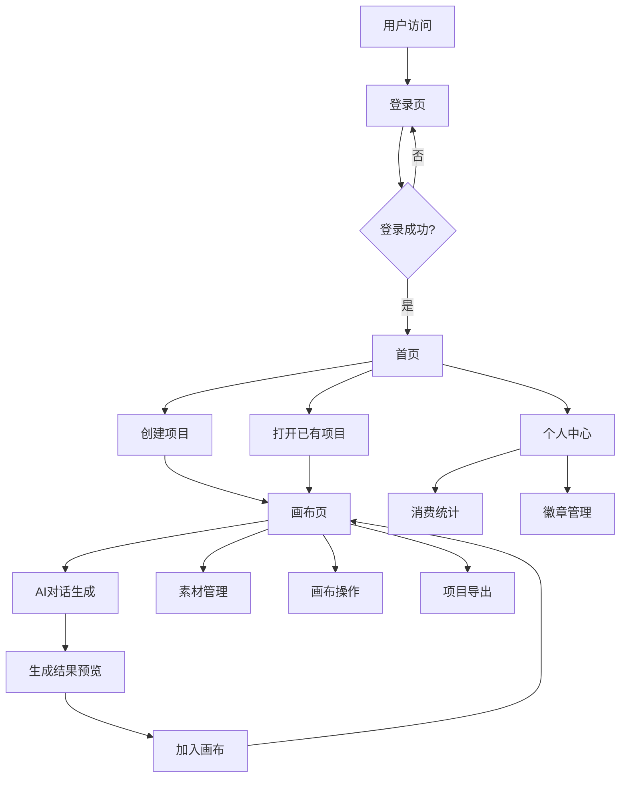

# 千域空间 PC平台 前端技术实现方案

## 一、技术选型

### 核心框架与语言
- **前端框架**：React 18
- **构建工具**：Vite 5
- **编程语言**：TypeScript
- **UI组件库**：Ant Design 5.x
- **状态管理**：Zustand
- **路由管理**：React Router 6
- **Canvas渲染**：Konva.js / react-konva
- **HTTP客户端**：Axios
- **样式解决方案**：CSS Modules + Less
- **代码规范**：ESLint + Prettier

### 第三方依赖
| 依赖名称 | 版本 | 用途 |
|---------|------|------|
| react | 18.2.0 | 核心前端库 |
| react-dom | 18.2.0 | React DOM操作 |
| react-router-dom | 6.20.0 | 路由管理 |
| zustand | 4.4.7 | 轻量级状态管理 |
| antd | 5.12.0 | UI组件库 |
| konva | 9.3.6 | Canvas渲染库 |
| react-konva | 18.2.10 | React封装的Konva |
| axios | 1.6.2 | HTTP客户端 |
| typescript | 5.3.3 | TypeScript支持 |
| vite | 5.0.10 | 构建工具 |
| less | 4.2.0 | CSS预处理器 |
| eslint | 8.55.0 | 代码质量检查 |
| prettier | 3.1.1 | 代码格式化 |

## 二、前端架构设计

### 架构模式
采用**组件化、模块化**的前端架构，遵循**单向数据流**原则，使用**状态管理**统一管理应用状态。

### 目录结构

```
frontend/
├── public/                  # 静态资源
├── src/
│   ├── components/          # 通用组件
│   │   ├── common/          # 基础组件
│   │   ├── layout/          # 布局组件
│   │   └── business/        # 业务组件
│   ├── pages/               # 页面组件
│   │   ├── Login/           # 登录页
│   │   ├── Home/            # 首页
│   │   ├── Canvas/          # 画布页
│   │   ├── Materials/       # 素材库
│   │   └── Profile/         # 个人中心
│   ├── hooks/               # 自定义hooks
│   ├── store/               # 状态管理
│   ├── services/            # API服务
│   ├── utils/               # 工具函数
│   ├── types/               # TypeScript类型定义
│   ├── styles/              # 全局样式
│   ├── routes/              # 路由配置
│   ├── App.tsx              # 应用根组件
│   └── main.tsx             # 应用入口
├── index.html               # HTML模板
├── tsconfig.json            # TypeScript配置
├── vite.config.ts           # Vite配置
├── package.json             # 项目配置
└── README.md                # 项目说明
```

### 核心流程图



## 三、页面与组件设计

### 页面设计

| 页面名称 | 路由 | 功能描述 | 核心组件 |
|---------|------|---------|---------|
| 登录页 | /login | 邮箱登录/注册 | LoginForm, RegisterForm, VerificationCode |
| 首页 | / | 项目列表、新建项目 | ProjectList, ProjectCard, CreateProjectModal |
| 画布页 | /canvas/:projectId | 无限画布创作、AI对话 | Canvas, AIChatPanel, ElementToolbar, PropertyPanel |
| 素材库 | /materials | 个人素材管理 | MaterialList, MaterialCard, FavoriteButton |
| 个人中心 | /profile | 用户信息、徽章、消费统计 | UserInfo, BadgeList, ConsumptionStats |
| 设置页 | /settings | 账号设置 | SettingsForm, PasswordChange |

### 核心组件设计

#### 1. 画布组件 (Canvas)
- **功能**：实现无限画布的渲染、缩放、平移、元素操作
- **技术实现**：使用react-konva库，支持拖拽、缩放、旋转等操作
- **状态管理**：画布状态存储在全局状态中，实时同步到后端

#### 2. AI对话面板 (AIChatPanel)
- **功能**：提供自然语言输入界面，支持参数调整，显示生成进度
- **技术实现**：使用Ant Design的Input和Form组件，实现实时输入和参数调整

#### 3. 项目列表组件 (ProjectList)
- **功能**：展示用户的项目列表，支持项目的创建、删除、重命名
- **技术实现**：使用Ant Design的List和Card组件，实现项目卡片的展示和操作

#### 4. 素材库组件 (MaterialList)
- **功能**：展示用户的素材列表，支持素材的预览、收藏、删除
- **技术实现**：使用Ant Design的List和Image组件，实现素材的网格展示

#### 5. 个人信息组件 (UserInfo)
- **功能**：展示用户的基本信息，支持信息的编辑和更新
- **技术实现**：使用Ant Design的Form和Avatar组件，实现信息的展示和编辑

## 四、状态管理方案

### 全局状态管理
使用Zustand进行轻量级状态管理，主要管理以下状态：

| 状态模块 | 管理内容 | 持久化 |
|---------|---------|--------|
| user | 用户信息、登录状态、token | localStorage |
| projects | 项目列表、当前项目信息 | sessionStorage |
| canvas | 画布状态、元素列表 | sessionStorage |
| materials | 素材列表、收藏状态 | sessionStorage |
| generation | 生成任务状态、历史记录 | sessionStorage |
| usage | 使用额度、消费统计 | sessionStorage |

### 状态管理示例

```typescript
// store/userStore.ts
import create from 'zustand';
import { persist } from 'zustand/middleware';

interface UserState {
  user: User | null;
  token: string | null;
  isLoggedIn: boolean;
  setUser: (user: User) => void;
  setToken: (token: string) => void;
  logout: () => void;
}

export const useUserStore = create<UserState>(
  persist(
    (set) => ({
      user: null,
      token: null,
      isLoggedIn: false,
      setUser: (user) => set({ user, isLoggedIn: true }),
      setToken: (token) => set({ token }),
      logout: () => set({ user: null, token: null, isLoggedIn: false }),
    }),
    {
      name: 'user-storage',
    }
  )
);
```

## 五、API接口对接方案

### API调用封装
使用Axios创建API服务，统一处理请求拦截、响应拦截、错误处理等。

### 接口对接示例

| API路径 | 方法 | 功能 | 前端调用 |
|---------|------|------|----------|
| /api/auth/login | POST | 用户登录 | api.auth.login({ email, password }) |
| /api/projects | GET | 获取项目列表 | api.projects.getList() |
| /api/projects | POST | 创建项目 | api.projects.create({ name }) |
| /api/projects/{id}/canvas | GET | 获取画布状态 | api.canvas.getState(projectId) |
| /api/projects/{id}/canvas | PUT | 保存画布状态 | api.canvas.saveState(projectId, state) |
| /api/generate/image | POST | 生成图片 | api.generate.image({ prompt, params }) |
| /api/generate/tasks/{id} | GET | 获取任务状态 | api.generate.getTaskStatus(taskId) |
| /api/materials | GET | 获取素材列表 | api.materials.getList() |
| /api/usage/quota | GET | 获取使用额度 | api.usage.getQuota() |
| /api/profile | GET | 获取个人信息 | api.profile.getInfo() |

### 错误处理策略
- **网络错误**：显示网络连接失败提示
- **认证错误**：跳转到登录页
- **业务错误**：显示错误信息提示
- **服务器错误**：显示系统错误提示

## 六、性能优化策略

### 1. 代码优化
- **代码分割**：使用React.lazy和Suspense实现组件懒加载
- **Tree Shaking**：移除未使用的代码
- **按需加载**：Ant Design组件按需导入

### 2. 渲染优化
- **Memo**：使用React.memo减少不必要的组件重渲染
- **useCallback**：缓存回调函数，避免不必要的重新创建
- **useMemo**：缓存计算结果，避免重复计算
- **虚拟滚动**：长列表使用虚拟滚动，如项目列表、素材列表

### 3. 网络优化
- **缓存策略**：合理使用浏览器缓存
- **请求合并**：合并多个API请求
- **防抖节流**：对频繁触发的事件进行防抖节流处理
- **WebSocket**：对实时性要求高的场景使用WebSocket

### 4. 资源优化
- **图片优化**：使用适当的图片格式和尺寸，支持懒加载
- **字体优化**：使用字体子集，减少字体文件大小
- **打包优化**：配置Vite的打包选项，减少打包体积

## 七、测试与部署计划

### 测试策略

| 测试类型 | 工具 | 范围 |
|---------|------|------|
| 单元测试 | Jest + React Testing Library | 组件测试、工具函数测试 |
| 集成测试 | Cypress | 页面功能测试、API对接测试 |
| E2E测试 | Cypress | 完整业务流程测试 |
| 性能测试 | Lighthouse | 页面性能、加载速度测试 |

### 部署方案

1. **构建**：使用Vite进行生产构建，生成优化后的静态文件
2. **部署**：部署到静态文件服务器或CDN
3. **CI/CD**：使用GitHub Actions或Jenkins实现自动化构建和部署
4. **环境配置**：
   - 开发环境：本地开发服务器
   - 测试环境：测试服务器
   - 生产环境：正式服务器

### 监控与日志
- **错误监控**：使用Sentry捕获前端错误
- **性能监控**：使用Lighthouse监控页面性能
- **用户行为分析**：使用Google Analytics或自建分析系统

## 八、开发规范

### 代码规范
- **命名规范**：使用小驼峰命名变量和函数，大驼峰命名组件
- **代码风格**：遵循ESLint和Prettier规范
- **注释规范**：关键代码添加注释，组件添加JSDoc注释

### 开发流程
1. **需求分析**：理解PRD需求，确定开发范围
2. **技术设计**：设计组件结构和数据流
3. **编码实现**：按照设计实现功能
4. **测试验证**：进行单元测试和集成测试
5. **代码审查**：提交代码进行审查
6. **部署上线**：部署到测试环境进行验证，然后上线

## 九、风险评估与应对策略

| 风险类型 | 识别点 | 应对措施 |
|---------|-------|--------|
| 性能问题 | 画布操作卡顿 | 使用requestAnimationFrame优化渲染，减少重绘 |
| 网络延迟 | API响应慢 | 实现请求缓存，添加加载状态和超时处理 |
| 兼容性问题 | 浏览器兼容性 | 使用Babel和Polyfill，测试主流浏览器 |
| 代码质量 | 代码冗余、难以维护 | 严格遵循代码规范，定期进行代码审查 |
| 安全问题 | XSS攻击、CSRF攻击 | 实现输入验证，使用HTTPS，设置合适的CORS策略 |

## 十、项目计划

### 开发阶段

| 阶段 | 任务 | 预计时间 |
|------|------|---------|
| 项目初始化 | 搭建项目脚手架、配置依赖 | 1周 |
| 核心功能 | 登录注册、项目管理、画布基础 | 2周 |
| AI集成 | AI对话、生成功能、素材管理 | 2周 |
| 优化完善 | 性能优化、测试、bug修复 | 1周 |
| 部署上线 | 部署测试、性能监控、用户反馈 | 1周 |
| 总计 | - | 7周 |

### 关键里程碑
1. **项目初始化完成**：搭建好项目结构，配置好开发环境
2. **核心功能实现**：完成登录注册、项目管理、画布基础功能
3. **AI功能集成**：完成AI对话、生成功能、素材管理
4. **性能优化**：完成代码优化、渲染优化、网络优化
5. **项目上线**：部署到生产环境，监控系统运行状态

---

**文档版本：V1.0**
**编制日期：2026年4月**
**编制团队：前端开发团队**